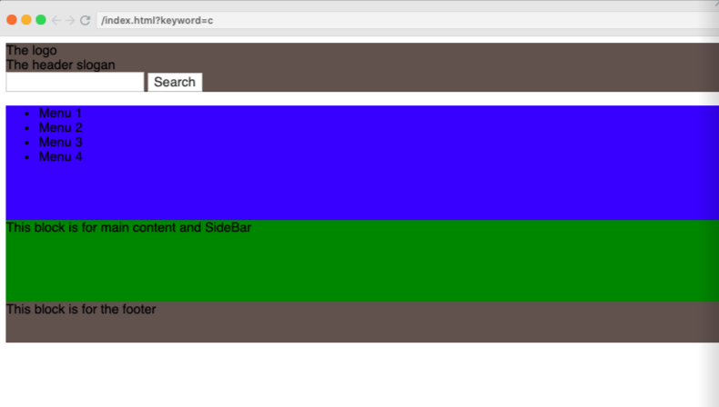
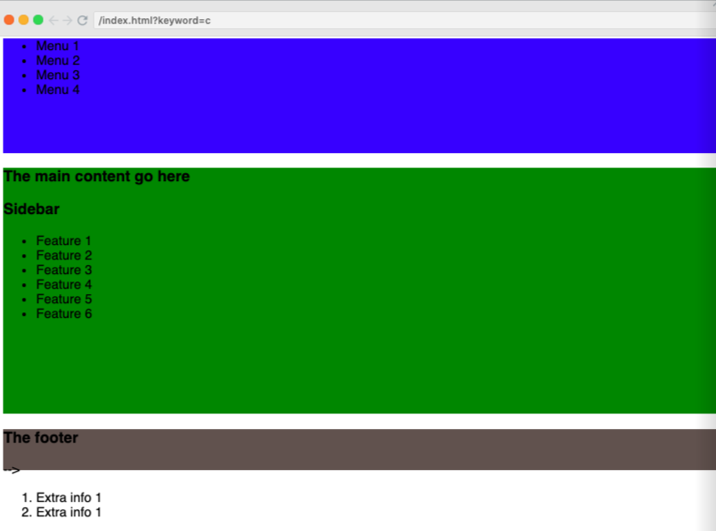
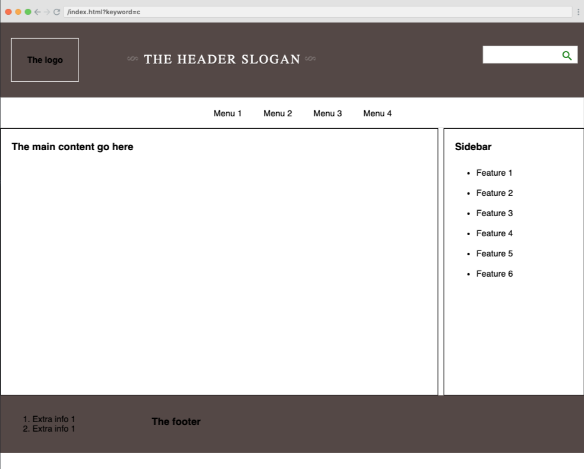

# 1. Build the layout with HTML
## 1.1 Prepare your project.
Determine which place to save you web page. and create a project named `my-webpage`

In this tut, I placed at `~/workspace`
Open the terminal and enter below commend to init your project

```bash
cd ~/workspace  # change working directory to workspace folder
mkdir my-webpage # create new folder name my-webpage
cd my-webpage
touch index.html # create the empty file
```

>If your did not know the linux commands, [check it here](TODO: ). Or you can you [Visual Studio Code](https://code.visualstudio.com/) editor to make it. 

To help your source code save, you should store it on the cloud instead of your local machine.

[Sign up a Github account](https://github.com/join?source=header-home) if you did not have yet.
> Don't know how to use git? [Check it here](TODO:)

## 1.2 Create a simple layout first.
Put below html code and try it on the browser

```html
<!-- index.html -->
<!DOCTYPE html>
<html lang="en">
  <head>
    <meta charset="utf-8">
    <title>My web page</title>
  </head>
  <body>
    <p> Hello worlds!</p>
  </body>
</html>
```
the attribue `lang="en"` does not impact on how your layout is displayed. It just support for Search engine, translation tools, [eg...](https://www.w3.org/International/questions/qa-lang-why)

`<title>My web page</title>` will display the content on the browser's tab.


Look down the mock-up layout, From `TOP to BOTTOM`, you will see `4 main parts` _(straigth follow the border of the rectangle)_, right?

So we will split it out 4 parts.
```html
<!-- index.html -->
<body>
    <header style="background-color: #5F524F; height: 60px;"> 
        this block is for the The header 
    </header>
    <nav style="background-color: blue; height: 40px;"> 
        This block is for navigation bar (menu) 
    </nav>
    <div id="main" style="background-color: green; height: 100px;">
        This block is for main content and SideBar</div>
    <footer style="background-color: #5F524F; height: 50px;">
        This block is for the footer
    </footer>
</body>
```

Relace `<p> Hello worlds!</p>` with above HTML code and try it on the browser


What can you look again?
- [\<meta>](https://www.w3schools.com/tags/att_meta_charset.asp)
- [\<header>, \<footer>, \<nav>](https://www.w3schools.com/tags/tag_header.asp)

## 1.3 Add you header
Split the header part to columns, We can split it to 3 columns
- 1st column: placed `the logo`
- 2nd column: placed `the slogan` (title: The header)
- 3rd column: placed `search form`

Now, add HTML code for presenting 3 columns

```html
<!-- index.html -->
<header style="background-color: #5F524F; height: 60px;"> 
    <div>The logo</div>
    <div>The header slogan</div>
    <div>
        <form method="GET">
            <input type="text" name="keyword" />
            <button type="submit" >Search</button>
        </form>
    </div>
</header>
```

Because `div` tag is a [block tag](https://www.w3schools.com/html/html_blocks.asp), so after close `</div>`  a new line will be added.

## 1.4 Add the navigation bar
You can also structure the navigation bar link the header. I mean you present it as 4 columns. 
But HTML has defined the list tag `li` to help you present kind of case efficently.

Replace the `<nav>` tag by below tags
```html
<!-- index.html -->
<nav style="background-color: blue; height: 140px;">
    <ul>
        <li>Menu 1</li>
        <li>Menu 2</li>
        <li>Menu 3</li>
        <li>Menu 4</li>
    </ul>
</nav>
```

Now, the layout will like this 

because `<li>` is block layout by default, so each `<li>` will display as a line.
But we can change it to [inline]() (mean many items in a line). We will change it later at the No.2 Styling the layout.

You can look again: 
- [\<ul>](https://www.w3schools.com/tags/tag_ul.asp)
- [inline & block ](https://www.w3schools.com/html/html_blocks.asp)

## 1.4 Add you main content and sidebar
The main section has 2 columns, Similar above, we will ad 2 block present as 2 columns.

```html
<!-- index.html -->
<div id="main" style="background-color: green; height: 400px;">
    <div id="main-content">
        <h3> The main content go here</h3>
    </div>
    <div id="sidebar">
        <h3> Sidebar </h3>
        <ul>
            <li>Feature 1</li>
            <li>Feature 2</li>
            <li>Feature 3</li>
            <li>Feature 4</li>
            <li>Feature 5</li>
            <li>Feature 6</li>
        </ul>
    </div>
</div>
```

## 1.5 Add the footer
We split the footer to 2 columns to place our info.
```html
<!-- index.html -->
<footer style="background-color: #5F524F; height: 50px;">
    <ol>
        <li>Extra info 1</li>
        <li>Extra info 1</li>
    </ol>
    <h3> The footer</h3>
</footer>
```

Combine all above step, you will have the layout similar this


***
### 2. Styling the layout
Until now, You have already prepared the simple layout structure. So now we will style for it.

We have 3 ways to style our layout. 
1. Use the `style` attribue of HTML's tag (inline).
2. Style internal html file (in the head tag)
3. Use the external css file `*.css` and include it in the `<head>` tag.

Usually, everyone combine both ways (1 & 3) to build their layout. But most of the css code is play at `*.css` file.

Now, create the `index.css` file at the same directory of `index.html`

```bash
cd ~/workspace/my-webpage
touch index.css
```

Link the index.css file to index.html, put the `<link>` tag inside the `<head>` tag
```html
<!-- index.html -->
<head>
    <link rel="stylesheet", href="index.css" />
    ...
</head>
```

look again: 
- [HTML CSS](https://www.w3schools.com/html/html_css.asp)

2.1 Style the header
Remove `style="background-color: #5F524F; height: 60px;"` in the header tag.

Put below content in the `index.css`

```css
/* index.css */
header {
    display: grid;
    height: 100px;
    grid-template-columns: 20% 50% 30%;
    justify-content: center;
    align-content: center;

    background-color: #5F524F;
    padding: 20px;
}

```

Use `display: grid` and `grid-template-columns: 20% 50% 30%;` to make the conent insde header tag become 3 columns.

`align-content: center;` to make the cotent align center as vertical.

Note that, each element has its default styling value. For example, the body tag will have some padding value. So, to remove it, we should reset all tag you want to init value.

```css
/* index.css */
html, body {
    margin: 0;
    padding: 0;
}
```

Now, we use 3 ways to get 3 columns (div) inside the `header` tag.

1. Use Pseudo-Element
Inside `header` tag have 3 div tags. To style for the header tag, we can use property `:first-child` to get the first `div`

```html
<!-- index.html -->
<header>
    <div>
        <h4>The logo</h4>
    </div>
    ...
</header>
```

```css
/* index.css */
header div:first-child {
    border: 1px solid #fff;
    padding: 10px;
    width: 50%;
}
```

2. Use Class
Add class attribute for the second div tag

```html
<!-- index.html -->
<div class="slogan">
    <h2>The header slogan</h2>
</div>
```

```css
/* index.css */
.slogan {
  color: #fff;
  font-weight: normal;
  font-size: 1.5em;
  font-family: 'EB Garamond', serif;
  letter-spacing: 0.1em;
  line-height: 1.5em;
  text-transform: uppercase;
  text-shadow: 0.07em 0.07em 0 rgba(0, 0, 0, 0.1);
  padding-top: 0.1em;
}

.slogan::before, .slogan::after {
  content: "§";
  display: inline-block;
  -webkit-transform: rotate(90deg);
  -moz-transform: rotate(90deg);
  -ms-transform: rotate(90deg);
  transform: rotate(90deg);
  opacity: 0.2;
  margin: 0 0.5em;
  font-size: 1em;
}

```

>`-webkit-transform, -moz-transform, -ms-transform` are optional style for difference browser.

By default is `transform`, only, but some browser does not have this property. but it has its owner.

Example: 
- `-webkit-` is prefix for Chrome, Opera
- `-moz-` is prefix for Fixfox
- `-ms-` is prefix for Edge

3. Use Id
To display the icon at the end of input text, we can use google icon by below reference to load the google font.

```html
<!-- index.html -->
<head>
    ...
    <link rel="stylesheet" href="https://fonts.googleapis.com/icon?family=Material+Icons">
</head>
```

Now to show the icon just replace the `<button>` tag by `<i class="material-icons">search</i>`.

>- `search` is the name of the icon, you can find more icon at [here](https://material.io/resources/icons/?icon=arrow_drop_up&style=baseline)
>- `class="material-icons"` is required class to allow google font know that you want to show the icon

Add the `id` attribute for div block of search form.
```html
<!-- index.html -->
<div id="search">
    <form method="GET">
        <input type="text" name="keyword" />
    </form>
</div>
```

```css
/* index.css */
#search form {
    float: right;
    margin-top: 14px;
    position: relative;
    width: 170px;
    height: 40%;
}

#search form input {
    padding: 6px;
}

#search form i {
    position: absolute;
    right: 0px;
    top: 8px;
    color: green;
}

```

Note that.
>- `#search form i { ... }` mean only apply for the `<i>` inside form and only `form` inside `#search` block
>-  `html, body { ... }` (separated by the coma `,`) mean apply for both `html` and `body` tag


Look again:
- [CSS Grid](https://www.w3schools.com/css/css_grid.asp)
- [Pseudo-Element](https://www.w3schools.com/css/css_pseudo_elements.asp)
- [CSS Selector](https://www.w3schools.com/css/css_selectors.asp)
- [CSS FLoat](https://www.w3schools.com/css/css_float.asp)
- [CSS Padding](https://www.w3schools.com/css/css_padding.asp)
- [CSS Margin](https://www.w3schools.com/css/css_margin.asp)

2.2 Style the navigation bar (menu)

Remove `style="background-color: blue; height: 140px;"` in the `nav` tag, put below css to index.css file.

```css
/* index.css */
nav {
    border: 1px solid #ccc;
}

nav ul {
    /* allow centering to work  */
    display: table; 
    margin: 0 auto;
}

nav ul li {
    display: inline-block;
    height: 15px;
    padding: 20px;
}
```

>`inline-block` property allow us to set the height property for `<li>` item

2.3 Style the Main

Similar the header, the main section has 2 columns, one for main content, one for the sidebar.

```css
/* index.css */
#main {
    display: grid;
    grid-template-columns: 75% auto;
    grid-column-gap: 10px;
    min-height: 500px;
}

#main-content, #sidebar {
    padding: 5px 20px;
    border: 1px solid;
}

#sidebar ul li {
    padding: 10px 0;
}
```

2.4 Style footer

- Remove the style attribute inside `<footer>`
- Add below css in index.css

```css
/* index.css */
footer {
    background-color: #5F524F;
    padding: 20px;

    display: grid;
    grid-template-columns: auto 75%;
}
```

__Notice:__

_If you style for the footer similar color and background like the header, you can group both of them to save css code like_

```css
/* index.css */
header, footer {
    background-color: #5F524F;
    padding: 20px;
}
```
and remove the `background-color` and `padding` inside `header { }` block.

well done, now check your layout


***
### 3. Add more actions for you webpage
3.1 Add button scroll to top

The scroll to top bottom usually stay at the right-bottom of the page.
So we add `<div id="scroll">...</div` block html code into the footer

```html
<!-- index.html -->
<footer>
    <ol>
        <li>Extra info 1</li>
        <li>Extra info 1</li>
    </ol>
    <h3> The footer</h3>
    <div id="scroll"> 
        <a href="#"> <i class="material-icons">arrow_drop_up</i></a>
    </div>
</footer>
```

>`href="#"`: will not allow the browser navigation to and not reload the page.

Style for the scroll-to-top button.

```css
/* index.css */
#scroll {
    width: 40px;
    height: 40px;

    position: fixed;
    right: 30px;
    bottom: 30px;

    background-color: rgba(2, 129, 1, 0.85);
    text-align: center;
}

#scroll a { color: #fff; }
#scroll i { margin-top: 8px; }
```

>`position: fixed`: will set the element is always fixed at a position base on the value of `right` and `bottom`

Now we add the javascript code to handle the action:
- when user click on the `scroll to top` button, it will scroll to the top of the page (smooth) and invisible that button, 
- when user scroll down again, the button will visible again.

Similar `css`, we can write our `js` code internal (inside html file.). But we should separate it to easier while.

Link javascript file `index.js` with `index.html`

```html
<!-- index.html -->
<head>
    ...
    <script src="index.js"></script>
</head>
```

```js
// index.js

function scrollToTop() {
    window.scrollTo({top: 0, behavior: 'smooth'}); 
}

window.addEventListener('scroll', function() {
    const lastPosition = window.scrollY;
    
    const scrollBtn = document.getElementById('scroll');
    
    if (lastPosition !== 0) {
        scrollBtn.setAttribute('style', 'display: block;');
    } else {
        scrollBtn.setAttribute('style', 'display: none;');
    }
});
```

When the html page was loaded, an event `scroll` will be binded to [window](https://www.w3schools.com/js/js_window.asp) object.

So that, each time the user scroll the page, the code inside block function () { ... } will be executed.

To let the button `scroll-top-top` works when click on, bind the method `scrollTopTop` on the event `onclick` of `<a>` tag.

```html
<a href="javascript:void(0);" onclick="scrollToTop()"> 
    <i class="material-icons">arrow_drop_up</i>
</a>
```

>`href="javascript:void(0);"` is a trick to prevent to page jump to top if you're set `href="#"` and click on its tag.
> its means attribute `href` will not works when `<a>` tag was clicked.
> Because result of `javascript:void(0)` return false;

In above code, we have an issue: when the page was load, and even the position of the page is at the top, so the `scroll-to-top` will still display.

To solve this case, after [DOM](https://www.w3schools.com/js/js_htmldom.asp) loaded, we will check the current position of the page and hide it.

The [load](https://www.w3schools.com/jsref/event_onload.asp) event will be triggered when DOM loaded, so place our checking code inside this binding event.

```js
// Refactor to reuse
function toggleScrollButton() {
    const lastPosition = window.scrollY;
    const scrollBtn = document.getElementById('scroll');
    
    if (lastPosition !== 0) {
        scrollBtn.setAttribute('style', 'display: block;');
    } else {
        scrollBtn.setAttribute('style', 'display: none;');
    }
}

window.addEventListener('scroll', function() {
    toggleScrollButton();
});

window.addEventListener('load', () => {
    toggleScrollButton();
});

```


